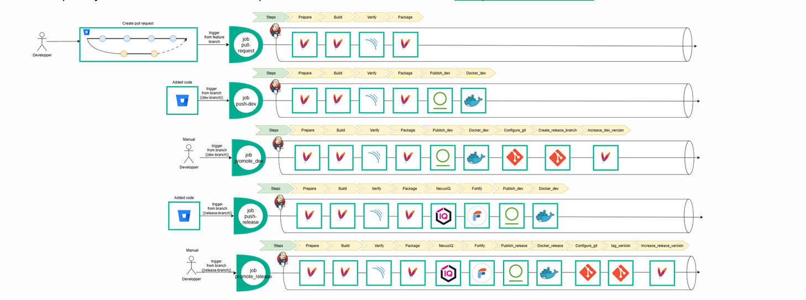

# cib-ci-pipeline

Jenkins Shared Library that standardizes the CI process for all **CIB Java / Maven** repositories hosted on BitBucket.

It exposes a single `cibPipeline` function. Each consuming project adds two files to its repository root and the correct pipeline flow runs automatically based on the trigger (PR, branch push, or manual execution).

---

## Pipeline Flows



Five flows are implemented, selected automatically from the build context:

| Flow | Trigger | Stages |
|------|---------|--------|
| **PR** | BitBucket pull request | Prepare → Build → Verify → Package |
| **Dev push** | Push to `dev` branch | + Publish Dev → Docker Dev |
| **Security branch push** | Push to `labels/*` or `analytics/*` | + NeuralD → Fortify → Publish Dev → Docker Dev |
| **Configure Dev** | Manual — `PIPELINE_TYPE=CONFIGURE_DEV` | Dev flow + Configure Git → Create Release Branch → Increase Dev Version |
| **Release** | Manual — `PIPELINE_TYPE=RELEASE` | Security flow + Publish Release → Docker Release → Configure Git → Tag Version → Increase Release Version |

### Stage reference

| Stage | Tool | Description |
|-------|------|-------------|
| Prepare | Maven | `mvn validate dependency:resolve` |
| Build | Maven | `mvn compile` |
| Verify | SonarQube | `mvn sonar:sonar` — static analysis & quality gate |
| Package | Maven | `mvn package` — produces the JAR/WAR |
| NeuralD | OWASP | `dependency-check` — third-party vulnerability scan |
| Fortify | Fortify SCA | SAST scan — source code security analysis |
| Publish Dev | Artifactory | Deploy snapshot to `libs-snapshot-local` |
| Publish Release | Artifactory | Deploy release to `libs-release-local` |
| Docker Dev | Docker | Build & push image tagged `{branch}-{build}` |
| Docker Release | Docker | Build & push image tagged with version and `latest` |
| Configure Git | Git | Set CI bot identity for automated commits |
| Create Release Branch | Git | Branch `release/{version}` from current state |
| Tag Version | Git | Annotated tag `v{version}` |
| Increase Dev Version | Maven | Bump patch SNAPSHOT version in `pom.xml` |
| Increase Release Version | Maven | Bump minor SNAPSHOT version in `pom.xml` |

---

## Prerequisites

Before onboarding a project, ensure the following are in place:

- A Jenkins instance accessible at:
  ```
  https://jenkins.cib.echonet/{shortname}-{dev|aps}.{shortname}/
  ```
- The `cib-ci-pipeline` library registered in **Jenkins → Manage Jenkins → Configure System → Global Pipeline Libraries**
- Credentials for the tools used by your project (see [Secrets Configuration](#secrets-configuration))
- Docker installed on the Jenkins agent (for Docker stages)
- Fortify SCA installed on the Jenkins agent (for security branches and release)

---

## Onboarding

### Step 1 — Create `.cib-ci.yml`

Create this file at the **repository root**. It must be UTF-8 encoded and named exactly `.cib-ci.yml`.

```yaml
template: mvn

secrets:
  artifactory:
    cyberark:
      name: ""        # CyberArk account name — leave blank if using Jenkins credentials
    jenkins:
      name: ""        # Jenkins credential ID (username+password) — used if cyberark.name is blank

  sonar:
    jenkins:
      name: ""        # Jenkins credential ID (secret text) for SonarQube token
      type: token

  git_ssh:
    jenkins:
      name: ""        # Jenkins credential ID (SSH private key) for Git push operations
      type: ssh-key

docker:
  registry: "registry.cib.echonet"   # Docker registry — override with your team's registry
```

Only fill in the secrets that apply to your team (CyberArk **or** Jenkins vault, not both).

See the full annotated template in [`docs/examples/.cib-ci.yml`](docs/examples/.cib-ci.yml).

---

### Step 2 — Create `Jenkinsfile`

Create this file at the **repository root**. It must be UTF-8 encoded and named exactly `Jenkinsfile`.

```groovy
@Library("cib-ci-pipeline") _
cibPipeline {
}
```

See [`docs/examples/Jenkinsfile`](docs/examples/Jenkinsfile).

---

### Step 3 — Configure the BitBucket Webhook

1. Open your BitBucket repository → **Repository Settings → Hooks**
2. Select the **Jenkins** hook (listed under pre-configured hooks)
3. Fill in:
   - **Jenkins URL**: `https://jenkins.cib.echonet/{shortname}-{dev|aps}.{shortname}/`
   - **Repository URL**: the SSH URL of your BitBucket repository
   - **Skip SSL Certificate Validation**: checked

---

### Step 4 (optional) — Pin tool versions

Create `.tool-versions` next to the root `pom.xml`:

```
java jdk-21
maven 3.9.3
```

If this file is absent, the pipeline defaults to `jdk-21` and Maven `3.9.3`.

See [`docs/examples/.tool-versions`](docs/examples/.tool-versions).

---

## Secrets Configuration

The pipeline supports two credential backends. Choose one per secret type.

### CyberArk (recommended for production)

Provide the **CyberArk account name** in `.cib-ci.yml`. The CyberArk Jenkins plugin retrieves the credential at runtime.

```yaml
secrets:
  artifactory:
    cyberark:
      name: "CIB_ARTIFACTORY_PROD"
```

### Jenkins Credential Vault

Provide the **Jenkins credential ID** (the ID you gave when storing the credential in Jenkins).

```yaml
secrets:
  artifactory:
    jenkins:
      name: "artifactory-myteam-creds"
```

### SonarQube token

Generate a **User Token** in SonarQube (**My Account → Security → Generate Token**), store it in Jenkins as a **Secret Text** credential, then reference its ID:

```yaml
secrets:
  sonar:
    jenkins:
      name: "sonarqube-token-myteam"
      type: token
```

The pipeline injects it as `-Dsonar.token` automatically.

### Git SSH key

Used by the pipeline to push commits (version bumps) and tags back to BitBucket.

1. Generate an SSH key pair dedicated to the CI bot.
2. Add the **public key** to a BitBucket service account.
3. Store the **private key** in Jenkins as an **SSH Username with private key** credential.
4. Reference its ID:

```yaml
secrets:
  git_ssh:
    jenkins:
      name: "bitbucket-ci-ssh-key"
      type: ssh-key
```

---

## PIPELINE_TYPE Parameter

By default the pipeline type is `AUTO` — detected from the build context. For manual flows, trigger the Jenkins job with a `PIPELINE_TYPE` parameter:

| Value | When to use |
|-------|-------------|
| `AUTO` | All automatic triggers (PR, branch push) |
| `CONFIGURE_DEV` | Prepare a release: create the release branch and bump the dev version |
| `RELEASE` | Publish a release artifact, push the Docker release image, and tag the version |

---

## Local Testing

Test the pipeline locally using **Jenkinsfile Runner** (Docker required).

```bash
# Clone this repository and run from its root

# Simulate a PR
./test/run-local.sh

# Simulate a push to dev
./test/run-local.sh dev

# Simulate a push to a security branch
./test/run-local.sh labels/analytics

# Run the CONFIGURE_DEV manual flow
./test/run-local.sh CONFIGURE_DEV

# Run the RELEASE manual flow
./test/run-local.sh RELEASE
```

On the first run Docker pulls `jenkins/jenkinsfile-runner:latest` (~1–2 min).  
Stages that call external services (SonarQube, Artifactory, Docker registry) will fail locally — this is expected. The goal is to verify that the correct stages are executed and skipped for each flow.

---

## Troubleshooting

| Symptom | Likely cause | Fix |
|---------|-------------|-----|
| `'.cib-ci.yml' not found` | File missing or not at repo root | Create the file following Step 1 |
| `withMaven step not found` | Maven Pipeline Plugin not installed on Jenkins | Install the **Pipeline Maven Integration** plugin |
| SonarQube stage fails with 401 | Wrong or expired token | Regenerate the SonarQube token and update the Jenkins credential |
| Git push fails in version bump stage | SSH key not trusted by BitBucket | Verify the public key is added to the BitBucket service account |
| Docker push fails | Agent not logged in to registry | Run `docker login registry.cib.echonet` on the Jenkins agent or configure a Docker credentials binding |
| Fortify `sourceanalyzer` not found | SCA not installed on agent | Install Fortify SCA on the Jenkins build agent or use a dedicated Fortify agent label |
